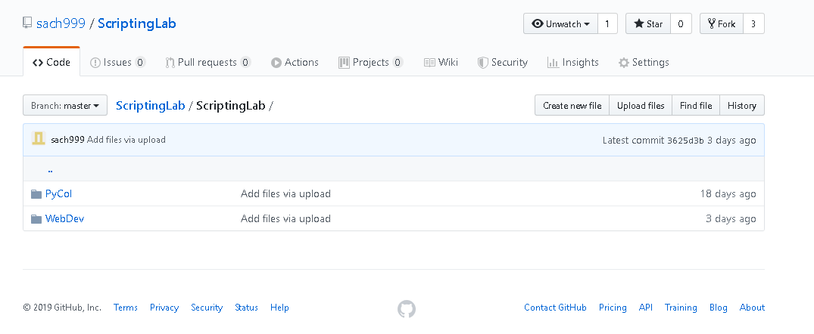
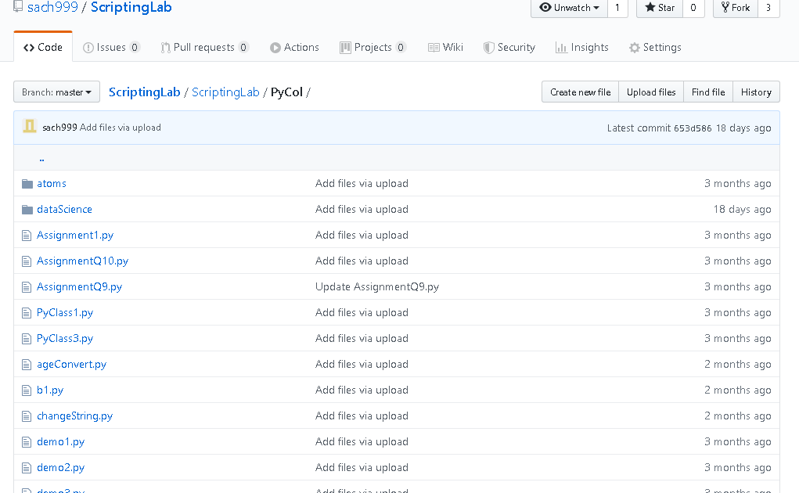
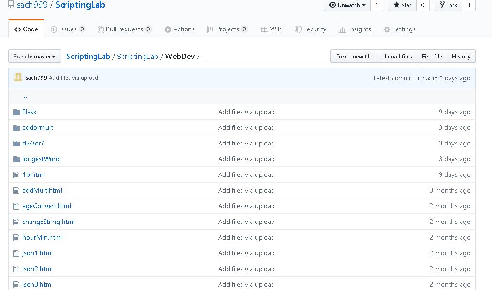
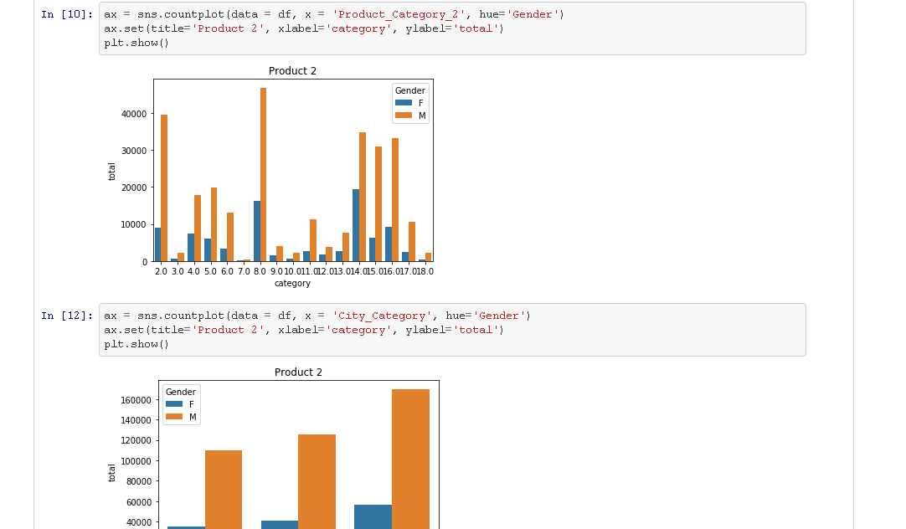
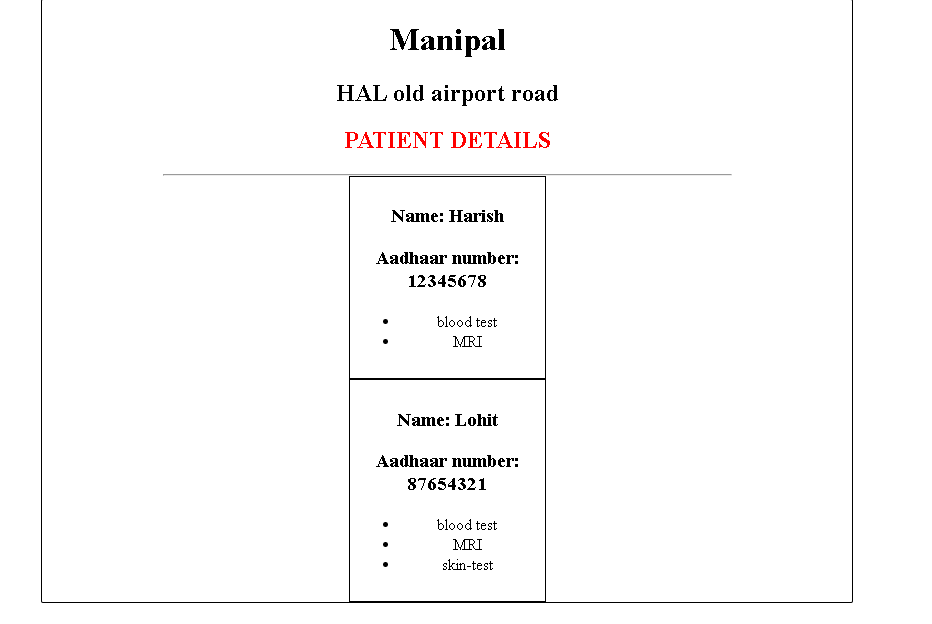

# Scripting Language Lab Programs Submission

### (under Department of ISE,Ramaiah Institute of Technology)

## USN:1MS17IS149

## Name: Sachin RS

## Section:5A

## Submitted to Dr. Mydhili K Nair (Faculty Coordinator)

 
## List of programs:

##### Basics of Python
  * Loops and List Comprehensions
  * List,tuples,dictionaries
  * Functions and Class
  
##### Python programs
  * ChangeString
  * LetterSurround
  * HourMinute
  * AgeConvert
  * OddRange
  * AtomicDictionary
  * StudentDetails
  * TemperatureConvert
  * SentenceReverse
  
##### JavaScript Programs
  * ChangeString
  * LetterSurround
  * HourMinute
  * AgeConvert
  * OddRange
  * LongestWord
  * Divisibility
  * Multiplication
  * Client side validation(Bakery)
  * JSON(Patient Details)
  * JSON(Car Details)
  * JSON(Color Names)
  
##### Data Visualization
  * Student Performance
  * Black Friday
  * Iris
  * Titanic
  
## Screenshots:
* My GitHub Repository

* Python Programs

* Javascript Programs

* Data Visualization Program on BlackFriday DataSet

* Javascript Program using JSON Object and hover action

